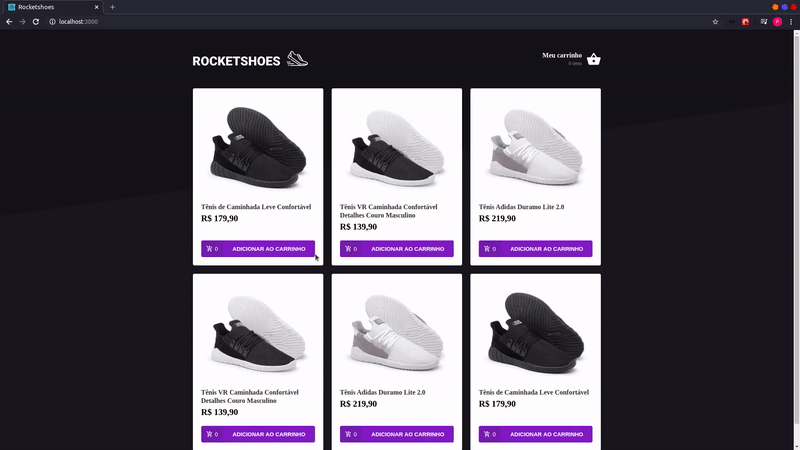

<h1 align="center">
  
</h1>

<h3  align="center">Rocketshoes - Web</h1>

Aplicação desenvolvida durante as aulas dos módulos sobre arquitetura flux e react hooks. Ela consiste em uma espécie de e-commerce de calçados, dentro da aplicação o usuário pode ver todos os itens em estoque e adicionar no carrinho na página inicial. Ao acessar a página de carrinho, o usuário pode alterar a quantidade dos itens e também pode removê-los do carrinho.

Você pode checar a versão mobile <a href="https://github.com/pfreitasbarbosa/rocketshoes-mobile" target="__blank">clicando aqui</a>.

## Preview

  

